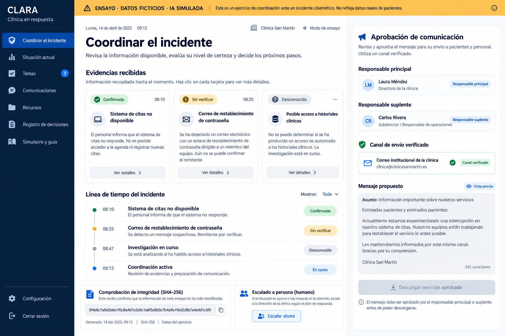
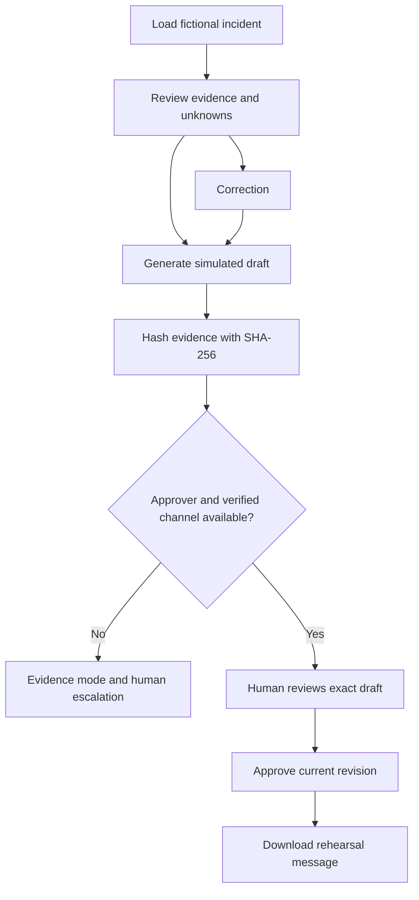
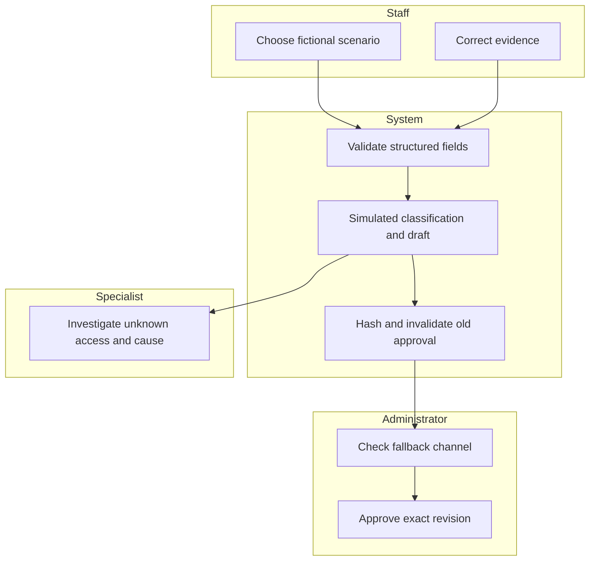

# PACKET - Fernanda Espinosa - Week 8
## CLARA: small-clinic incident coordination
Author: Fernanda Espinosa | MONEY lens | Prepared before application code.

## Problem in my words
A small clinic facing a suspected compromise of its appointment account must keep decisions and patient communication reliable while its IT provider investigates. Staff may confuse reports with facts or publish reassurance without approval. The buyer is the owner or administrator, not the patient.

## Exact user
Fictional clinic administrator Elena, 46, in Mexico City, uses appointment software and WhatsApp, has no forensic training, and must coordinate reception and the external IT provider under time pressure. Only fictional data are used.

## Success before the module closes
A working URL loads a fictional incident, preserves confirmed/unverified/unknown distinctions, creates a SHA-256 integrity receipt, stops export without an available approver and a verified fallback channel, invalidates approval after any revision, and exports an approved rehearsal message. A cost calculator makes full-cost assumptions visible; no paid demand is claimed.

## Image-generated mockup

Concept only; application implementation may differ. Generation requested before code.

## Flowchart

## Swimlane

## Benchmark line
There is no proven universal best solution; the strongest relevant precedent in this research is IDCARE's Small Business Cyber Resilience Service, providing expert support for Australian small businesses. CLARA localizes a much narrower rehearsal to Spanish-speaking Mexican clinic administrators, with evidence separation, fallback-channel checks, explicit approval and visible delivery costs; it does not replicate IDCARE's expert service.
ACSC incident-response planning guidance is the operational benchmark for roles and communications.
Sources checked 30 September 2026: https://www.idcare.org/smallbusiness ; https://www.cyber.gov.au/business-government/detecting-responding-to-threats/cyber-security-incident-response/cyber-security-incident-response-planning-executive-guidance

## Long view - three sentences
In three years this could become a practiced coordination service distributed through qualified clinic IT partners. Each clinic would maintain verified fallback contacts and rehearse decision boundaries before incidents occur. Expansion would depend on paid commitments, full-cost margins, fewer communication errors and lower specialist workload, rather than a security score or promised recovery.

## Scope cut
No antivirus, password manager, live threat detection, patient records, remote control, attack-back, ransom actions, automatic publication, legal notification decisions or forensic conclusions. The demo stores no server data, has no free-text personal-data intake and accepts only fictional scenario choices. Approval is a single-session rehearsal control, not production identity verification.

## Architecture and Dragon Stack
| Layer | Implementation | Truth label |
| --- | --- | --- |
| LLM | Curated outputs derived from the fictional brief exercise, deterministic scenario-specific drafts | IA SIMULADA, no live model call |
| Security API/tooling | Browser Web Crypto SHA-256 over canonical incident JSON | Real cryptographic operation, not evidence admissibility or breach detection |
| Additional layer | Structured fictional breach data, revision approval state machine and escalation automation | Local browser workflow |
| Interface | Static HTML, CSS, JavaScript; Spanish, responsive, keyboard controls | Working slice |
| Persistence | In-memory session only; reset on reload | No database or personal-data storage |
| Hosting | Sites with versioned git source | Two deployments planned |

## Blueprint conditions honored
1. Separate confirmed, unverified, unknown and human escalation; never declare secure.
2. Shadow clause: no attack-back, accusation, secrets, remote control or ransom action; no autonomous authority.
3. Explicit named rehearsal approver plus verified channel before export; approval tied to revision.
4. Unknown access stays unknown; specialist investigates; hashing never upgrades evidence.
5. Plain Spanish, clear primary/backup roles and fallback guidance.
6. Cost calculator includes staff, support and overhead; five-clinic paid pilot remains future work. Kill if fewer than 3/5 pay full cost, every case is heavily customized, or coordination is unsafe.

## Security Floor before build
No credentials or API keys. No personal data intake or server persistence, so Supabase Auth and row-level security are not applicable to this rehearsal. Select values and numeric ranges validated; output rendered as text; fixed seeds fictional and labeled. Production use requires verified authentication, role authorization and protected storage before any personal data is introduced.

## Test plan
Mechanical: scenario labels; unavailable primary routes to backup; both unavailable blocks export; unverified fallback blocks approval; revision invalidates approval; SHA-256 length/determinism/change; invalid price inputs rejected; full-cost margin; mobile overflow; no network submissions; no secrets. Record one genuine failing assertion, fix and rerun, then redeploy.
Persona: synthetic Elena, 46, clinic administrator, hurried and nontechnical. In a fresh synthetic-user session, review sequential screenshots, narrate hesitation, log confusions and fix the worst. This is simulated usability evidence, not a real-user study.

## Implementation prompt
Build CLARA as a static responsive Spanish rehearsal. Use fixed fictional scenarios only. Implement evidence cards, simulated draft, SHA-256 receipt, primary/backup availability, verified fallback channel, current-revision approval and export; changes must revoke approval. Add a full-cost calculator. Never send messages externally or accept records. Commit packet before code, then UI, workflow/security, first-release verification, bug fix/persona improvement, and Session Close. Deploy the first usable version and the corrected version. Log actual tests and limitations, not invented results.
